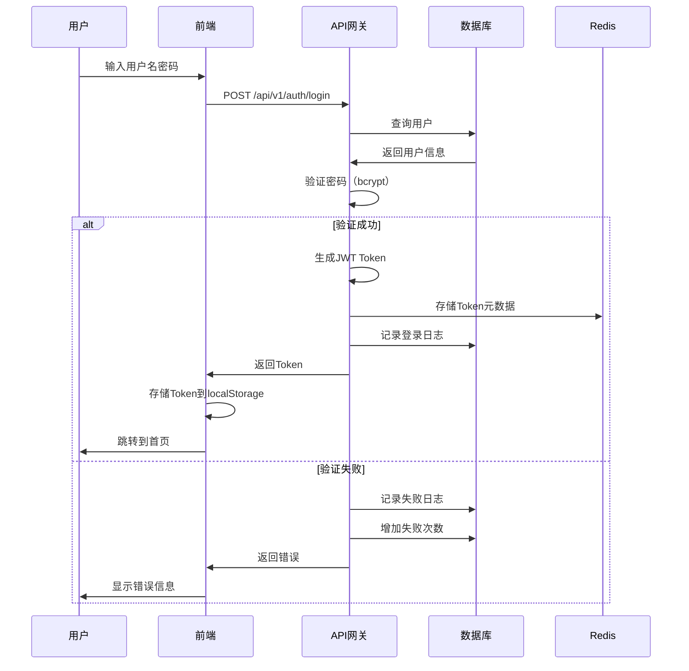

# 认证与权限管理方案（简化版RBAC）

## 一、方案概述

### 1.1 设计原则
- **简单实用**：3个角色满足基本需求
- **易于扩展**：预留扩展接口
- **安全可靠**：JWT + bcrypt加密
- **审计追踪**：记录所有操作

### 1.2 技术选型
- **认证方式**：JWT Token
- **密码加密**：bcrypt
- **权限模型**：RBAC（基于角色的访问控制）
- **会话管理**：Redis存储Token黑名单

---

## 二、角色定义

### 2.1 角色说明

| 角色 | 英文名 | 人数 | 主要职责 |
|------|--------|------|---------|
| 管理员 | admin | 1-2人 | 系统管理、价格配置、用户管理 |
| 操作员 | operator | 5-20人 | 日常操作、上传文件、查看报表 |
| 查看者 | viewer | 5-10人 | 查看报表、数据分析 |

### 2.2 权限矩阵

| 功能模块 | 具体功能 | Admin | Operator | Viewer |
|---------|---------|-------|----------|--------|
| **文件管理** | 上传DWG/PRT文件 | ✅ | ✅ | ❌ |
| | 删除文件 | ✅ | ✅(自己的) | ❌ |
| **任务管理** | 创建任务 | ✅ | ✅ | ❌ |
| | 查看自己的任务 | ✅ | ✅ | ✅ |
| | 查看所有任务 | ✅ | ❌ | ✅ |
| | 删除任务 | ✅ | ✅(自己的) | ❌ |
| **交互功能** | 提交参数 | ✅ | ✅ | ❌ |
| | 重新识别 | ✅ | ✅ | ❌ |
| **重算功能** | 单个重算 | ✅ | ✅ | ❌ |
| | 批量重算 | ✅ | ✅ | ❌ |
| **报表功能** | 查看报表 | ✅ | ✅ | ✅ |
| | 下载报表 | ✅ | ✅ | ✅ |
| **价格管理** | 查看价格库 | ✅ | ✅ | ✅ |
| | 修改价格库 | ✅ | ❌ | ❌ |
| | 价格版本管理 | ✅ | ❌ | ❌ |
| **规则管理** | 查看规则库 | ✅ | ✅ | ✅ |
| | 修改规则库 | ✅ | ❌ | ❌ |
| **用户管理** | 查看用户列表 | ✅ | ❌ | ❌ |
| | 创建用户 | ✅ | ❌ | ❌ |
| | 修改用户 | ✅ | ❌ | ❌ |
| | 禁用用户 | ✅ | ❌ | ❌ |
| **审计日志** | 查看审计日志 | ✅ | ❌ | ❌ |
| | 导出审计日志 | ✅ | ❌ | ❌ |

---

## 三、数据库设计

### 3.1 users表（用户表）

```sql
CREATE TABLE users (
    user_id UUID PRIMARY KEY DEFAULT uuid_generate_v4(),
    username VARCHAR(50) NOT NULL UNIQUE,
    password_hash VARCHAR(255) NOT NULL,
    email VARCHAR(100) UNIQUE,
    real_name VARCHAR(50),
    
    -- 角色和部门
    role VARCHAR(20) NOT NULL DEFAULT 'operator',
    department VARCHAR(50),
    
    -- 状态
    is_active BOOLEAN DEFAULT true,
    is_locked BOOLEAN DEFAULT false,
    failed_login_attempts INTEGER DEFAULT 0,
    
    -- 时间戳
    last_login_at TIMESTAMP,
    last_login_ip VARCHAR(50),
    created_at TIMESTAMP NOT NULL DEFAULT NOW(),
    updated_at TIMESTAMP NOT NULL DEFAULT NOW(),
    created_by UUID REFERENCES users(user_id),
    
    -- 扩展字段
    metadata JSONB,
    
    CONSTRAINT chk_role CHECK (role IN ('admin', 'operator', 'viewer'))
);

-- 索引
CREATE INDEX idx_users_username ON users(username);
CREATE INDEX idx_users_email ON users(email);
CREATE INDEX idx_users_role ON users(role);
CREATE INDEX idx_users_department ON users(department);
CREATE INDEX idx_users_is_active ON users(is_active);

-- 初始管理员账号
INSERT INTO users (username, password_hash, email, real_name, role)
VALUES ('admin', '$2b$12$...', 'admin@example.com', '系统管理员', 'admin');
```

### 3.2 修改jobs表（添加user_id）

```sql
-- jobs表已有user_id字段，添加外键约束
ALTER TABLE jobs
ADD CONSTRAINT fk_jobs_user_id 
FOREIGN KEY (user_id) REFERENCES users(user_id);

-- 添加索引
CREATE INDEX idx_jobs_user_id ON jobs(user_id);
```

### 3.3 login_logs表（登录日志）

```sql
CREATE TABLE login_logs (
    log_id BIGSERIAL PRIMARY KEY,
    user_id UUID REFERENCES users(user_id),
    username VARCHAR(50) NOT NULL,
    login_type VARCHAR(20) NOT NULL, -- login/logout/token_refresh
    status VARCHAR(20) NOT NULL, -- success/failed
    ip_address VARCHAR(50),
    user_agent VARCHAR(255),
    failure_reason VARCHAR(255),
    created_at TIMESTAMP NOT NULL DEFAULT NOW()
);

-- 索引
CREATE INDEX idx_login_logs_user_id ON login_logs(user_id);
CREATE INDEX idx_login_logs_created_at ON login_logs(created_at DESC);

-- 分区策略：按月分区
```

---

## 四、认证流程

### 4.1 登录流程



### 4.2 Token结构

```json
{
  "header": {
    "alg": "RS256",
    "typ": "JWT"
  },
  "payload": {
    "user_id": "uuid",
    "username": "zhangsan",
    "role": "operator",
    "department": "engineering",
    "iat": 1704787200,
    "exp": 1704794400
  },
  "signature": "..."
}
```

### 4.3 Token刷新流程

```python
# 访问Token：2小时有效期
access_token_expire = 2 * 60 * 60  # 2小时

# 刷新Token：7天有效期
refresh_token_expire = 7 * 24 * 60 * 60  # 7天

# 刷新流程
POST /api/v1/auth/refresh
{
  "refresh_token": "..."
}

# 返回新的access_token
{
  "access_token": "...",
  "token_type": "bearer",
  "expires_in": 7200
}
```

---

## 五、权限检查实现

### 5.1 装饰器实现

```python
from functools import wraps
from fastapi import HTTPException, status

def require_role(*allowed_roles):
    """
    权限检查装饰器
    
    用法:
    @require_role("admin")
    @require_role("admin", "operator")
    """
    def decorator(func):
        @wraps(func)
        async def wrapper(*args, current_user=None, **kwargs):
            if not current_user:
                raise HTTPException(
                    status_code=status.HTTP_401_UNAUTHORIZED,
                    detail="未登录"
                )
            
            if current_user.role not in allowed_roles:
                raise HTTPException(
                    status_code=status.HTTP_403_FORBIDDEN,
                    detail=f"需要{allowed_roles}权限"
                )
            
            return await func(*args, current_user=current_user, **kwargs)
        return wrapper
    return decorator

# 使用示例
@router.post("/api/v1/price-items/")
@require_role("admin")
async def create_price_item(
    item: PriceItemCreate,
    current_user: User = Depends(get_current_user)
):
    """创建价格项（仅管理员）"""
    pass

@router.post("/api/v1/jobs/")
@require_role("admin", "operator")
async def create_job(
    files: UploadFile,
    current_user: User = Depends(get_current_user)
):
    """创建任务（管理员和操作员）"""
    pass
```

### 5.2 数据权限过滤

```python
async def get_jobs_list(
    current_user: User,
    skip: int = 0,
    limit: int = 20
):
    """获取任务列表（带权限过滤）"""
    query = select(Job)
    
    # 操作员只能看自己的任务
    if current_user.role == "operator":
        query = query.where(Job.user_id == current_user.user_id)
    
    # 管理员和查看者可以看所有任务
    # （如果需要部门隔离，可以添加department过滤）
    
    query = query.offset(skip).limit(limit)
    result = await db.execute(query)
    return result.scalars().all()
```

---

## 六、API接口设计

### 6.1 认证相关接口

```python
# 登录
POST /api/v1/auth/login
{
  "username": "zhangsan",
  "password": "password123"
}
Response: {
  "access_token": "...",
  "refresh_token": "...",
  "token_type": "bearer",
  "expires_in": 7200,
  "user": {
    "user_id": "uuid",
    "username": "zhangsan",
    "role": "operator",
    "department": "engineering"
  }
}

# 登出
POST /api/v1/auth/logout
Headers: Authorization: Bearer <token>
Response: {"message": "登出成功"}

# 刷新Token
POST /api/v1/auth/refresh
{
  "refresh_token": "..."
}
Response: {
  "access_token": "...",
  "expires_in": 7200
}

# 获取当前用户信息
GET /api/v1/auth/me
Headers: Authorization: Bearer <token>
Response: {
  "user_id": "uuid",
  "username": "zhangsan",
  "email": "zhangsan@example.com",
  "role": "operator",
  "department": "engineering"
}

# 修改密码
POST /api/v1/auth/change-password
{
  "old_password": "old123",
  "new_password": "new456"
}
```

### 6.2 用户管理接口（仅管理员）

```python
# 获取用户列表
GET /api/v1/users/?skip=0&limit=20
Response: {
  "users": [...],
  "total": 50
}

# 创建用户
POST /api/v1/users/
{
  "username": "lisi",
  "password": "password123",
  "email": "lisi@example.com",
  "real_name": "李四",
  "role": "operator",
  "department": "engineering"
}

# 更新用户
PUT /api/v1/users/{user_id}
{
  "email": "newemail@example.com",
  "role": "viewer",
  "department": "finance"
}

# 禁用/启用用户
POST /api/v1/users/{user_id}/toggle-active
{
  "is_active": false
}

# 重置密码
POST /api/v1/users/{user_id}/reset-password
{
  "new_password": "newpassword123"
}
```

---

## 七、前端实现

### 7.1 登录页面

```typescript
// Login.tsx
const handleLogin = async (values: LoginForm) => {
  try {
    const response = await fetch('/api/v1/auth/login', {
      method: 'POST',
      headers: { 'Content-Type': 'application/json' },
      body: JSON.stringify(values)
    });
    
    const data = await response.json();
    
    // 存储Token
    localStorage.setItem('access_token', data.access_token);
    localStorage.setItem('refresh_token', data.refresh_token);
    localStorage.setItem('user', JSON.stringify(data.user));
    
    // 跳转到首页
    navigate('/');
  } catch (error) {
    message.error('登录失败');
  }
};
```

### 7.2 权限控制组件

```typescript
// PermissionGuard.tsx
interface PermissionGuardProps {
  roles: string[];
  children: React.ReactNode;
  fallback?: React.ReactNode;
}

const PermissionGuard: React.FC<PermissionGuardProps> = ({
  roles,
  children,
  fallback = null
}) => {
  const user = JSON.parse(localStorage.getItem('user') || '{}');
  
  if (roles.includes(user.role)) {
    return <>{children}</>;
  }
  
  return <>{fallback}</>;
};

// 使用示例
<PermissionGuard roles={['admin']}>
  <Button onClick={handleEditPrice}>修改价格</Button>
</PermissionGuard>

<PermissionGuard roles={['admin', 'operator']}>
  <Button onClick={handleUpload}>上传文件</Button>
</PermissionGuard>
```

### 7.3 路由守卫

```typescript
// PrivateRoute.tsx
const PrivateRoute: React.FC<{ children: React.ReactNode }> = ({ children }) => {
  const token = localStorage.getItem('access_token');
  
  if (!token) {
    return <Navigate to="/login" />;
  }
  
  return <>{children}</>;
};

// App.tsx
<Routes>
  <Route path="/login" element={<Login />} />
  <Route path="/" element={
    <PrivateRoute>
      <Layout />
    </PrivateRoute>
  }>
    <Route index element={<Dashboard />} />
    <Route path="jobs" element={<JobList />} />
    <Route path="users" element={
      <PermissionGuard roles={['admin']}>
        <UserManagement />
      </PermissionGuard>
    } />
  </Route>
</Routes>
```

---

## 八、安全措施

### 8.1 密码安全
- ✅ bcrypt加密（cost=12）
- ✅ 密码强度要求：至少8位，包含字母和数字
- ✅ 密码不能与用户名相同
- ✅ 定期提醒修改密码（可选）

### 8.2 登录安全
- ✅ 失败5次后锁定账号15分钟
- ✅ 记录登录IP和User-Agent
- ✅ 异常登录告警（可选）

### 8.3 Token安全
- ✅ 使用RS256算法签名
- ✅ Token有效期2小时
- ✅ 刷新Token有效期7天
- ✅ 登出时加入黑名单

### 8.4 API安全
- ✅ HTTPS传输
- ✅ CORS配置
- ✅ 限流保护（每用户每分钟100次）
- ✅ SQL注入防护（使用ORM）
- ✅ XSS防护（前端自动转义）

---

## 九、实施计划

### 9.1 开发任务（2天）

**Day 1（人员B2）**:
- [ ] 创建users表和login_logs表
- [ ] 实现用户注册/登录API
- [ ] 实现JWT Token生成和验证
- [ ] 实现权限检查装饰器

**Day 2（人员B2 + 人员C）**:
- [ ] 实现用户管理API（管理员功能）
- [ ] 前端登录页面
- [ ] 前端权限控制组件
- [ ] 集成测试

### 9.2 测试用例

```python
# 测试登录
def test_login_success():
    response = client.post("/api/v1/auth/login", json={
        "username": "testuser",
        "password": "password123"
    })
    assert response.status_code == 200
    assert "access_token" in response.json()

# 测试权限
def test_operator_cannot_modify_price():
    # 以operator身份登录
    token = login_as_operator()
    
    # 尝试修改价格
    response = client.post(
        "/api/v1/price-items/",
        headers={"Authorization": f"Bearer {token}"},
        json={...}
    )
    assert response.status_code == 403

# 测试数据隔离
def test_operator_can_only_see_own_jobs():
    token = login_as_operator("user1")
    
    response = client.get(
        "/api/v1/jobs/",
        headers={"Authorization": f"Bearer {token}"}
    )
    
    jobs = response.json()["jobs"]
    assert all(job["user_id"] == "user1_id" for job in jobs)
```

---

## 十、扩展方案（第二期）

如果业务发展需要，可以扩展：

### 10.1 部门管理
- 创建departments表
- 支持部门层级结构
- 部门级别的数据隔离

### 10.2 更细粒度的权限
- 创建permissions表
- 角色-权限关联表
- 动态权限配置

### 10.3 操作审计
- 记录所有敏感操作
- 操作回放功能
- 异常行为检测

### 10.4 单点登录（SSO）
- 集成企业AD/LDAP
- OAuth2.0支持
- SAML支持

---

## 总结

简化版RBAC方案：
- ✅ **简单实用**：3个角色满足基本需求
- ✅ **开发快速**：2天完成
- ✅ **安全可靠**：JWT + bcrypt
- ✅ **易于扩展**：预留扩展接口
- ✅ **满足审计**：记录所有操作

这个方案在保证安全性的同时，不会过度增加系统复杂度，适合6周的开发周期。
