# 模具成本核算系统 - 数据库ER图

## 完整ER图

```mermaid
erDiagram
    users ||--o{ jobs : "创建"
    users ||--o{ audit_logs : "操作"
    users ||--o{ recalculations : "发起"
    
    jobs ||--o{ subgraphs : "包含"
    jobs ||--o{ features : "特征"
    jobs ||--o{ job_price_snapshots : "价格快照"
    jobs ||--o{ job_process_snapshots : "工艺快照"
    jobs ||--o{ user_interactions : "产生"
    jobs ||--o{ operation_logs : "记录"
    jobs ||--o{ reports : "生成"
    jobs ||--o{ archives : "归档"
    jobs ||--o{ recalculations : "重算"
    jobs ||--o{ batch_recalculations : "批量重算"
    jobs ||--o{ nc_calculations : "NC计算"
    jobs ||--o{ report_summary : "汇总"
    
    subgraphs ||--o{ features : "特征历史"
    batch_recalculations ||--o{ recalculations : "包含"
    
    price_items ||--o{ job_price_snapshots : "复制"
    process_rules ||--o{ job_process_snapshots : "复制"
    
    users {
        UUID user_id PK "用户ID"
        VARCHAR username "用户名"
        VARCHAR password_hash "密码哈希"
        VARCHAR email "邮箱"
        VARCHAR role "角色"
        VARCHAR department "部门"
        BOOLEAN is_active "是否激活"
        TIMESTAMP last_login_at "最后登录时间"
        TIMESTAMP created_at "创建时间"
        TIMESTAMP updated_at "更新时间"
        JSONB metadata "元数据"
    }

    jobs {
        UUID job_id PK "任务ID"
        VARCHAR user_id "用户ID"
        VARCHAR dwg_file_id "DWG文件ID"
        VARCHAR dwg_file_name "DWG文件名"
        VARCHAR dwg_file_path "DWG路径"
        BIGINT dwg_file_size "DWG大小"
        VARCHAR prt_file_id "PRT文件ID"
        VARCHAR prt_file_name "PRT文件名"
        VARCHAR prt_file_path "PRT路径"
        BIGINT prt_file_size "PRT大小"
        VARCHAR status "状态"
        VARCHAR current_stage "当前阶段"
        INTEGER progress "进度"
        INTEGER total_subgraphs "子图总数"
        DECIMAL total_cost "总成本"
        VARCHAR currency "货币"
        TEXT_ARRAY processes_used "工艺列表"
        DECIMAL material_cost "材料费"
        DECIMAL heat_treatment_cost "热处理费"
        DECIMAL fast_wire_cost "快丝合计"
        DECIMAL mid_wire_cost "中丝合计"
        DECIMAL slow_wire_cost "慢丝合计"
        DECIMAL nc_cost "NC成本"
        DECIMAL grinding_cost "磨床成本"
        DECIMAL edm_cost "放电成本"
        DECIMAL processing_cost_total "加工成本合计"
        VARCHAR report_id "报表ID"
        VARCHAR price_version_locked "价格版本锁定"
        VARCHAR process_version_locked "工艺版本锁定"
        TIMESTAMP snapshot_created_at "快照创建时间"
        TIMESTAMP created_at "创建时间"
        TIMESTAMP updated_at "更新时间"
        TIMESTAMP completed_at "完成时间"
        TIMESTAMP archived_at "归档时间"
        TEXT error_message "错误信息"
        JSONB metadata "元数据"
    }

    subgraphs {
        VARCHAR subgraph_id PK "子图ID"
        UUID job_id FK "任务ID"
        VARCHAR part_name "零件名称"
        VARCHAR part_code "编号"
        VARCHAR material "材质"
        VARCHAR subgraph_file_url "子图文件URL"
        DECIMAL weight_kg "实际重量kg"
        DECIMAL material_unit_price "材料单价"
        DECIMAL material_cost "材料费"
        DECIMAL heat_treatment_unit_price "热处理单价"
        DECIMAL heat_treatment_cost "热处理费"
        VARCHAR process_description "工艺说明"
        DECIMAL nc_roughing_time "NC开粗时间"
        DECIMAL nc_milling_time "NC精铣时间"
        DECIMAL drilling_time "钻床时间"
        DECIMAL milling_machine_time "铣床时间"
        DECIMAL large_grinding_time "大磨床时间"
        INTEGER small_grinding_count "小磨床数"
        DECIMAL slow_wire_length "慢丝长度"
        DECIMAL slow_wire_side_length "慢丝侧割长度"
        DECIMAL mid_wire_length "中丝长度"
        DECIMAL fast_wire_length "快丝长度"
        DECIMAL edm_time "放电时间"
        DECIMAL engraving_time "雕刻时间"
        VARCHAR separate_item "单独项"
        DECIMAL total_cost "费用总计"
        TEXT wire_process_note "线割工艺说明"
        DECIMAL nc_roughing_cost "NC开粗费"
        DECIMAL nc_milling_cost "NC精铣费"
        DECIMAL drilling_cost "钻床费"
        DECIMAL milling_machine_cost "铣床费"
        DECIMAL large_grinding_cost "大磨床费"
        DECIMAL small_grinding_cost "小磨床费"
        DECIMAL slow_wire_cost "慢丝费"
        DECIMAL slow_wire_side_cost "慢丝侧割费"
        DECIMAL mid_wire_cost "中丝费"
        DECIMAL fast_wire_cost "快丝费"
        DECIMAL edm_cost "放电费"
        DECIMAL engraving_cost "雕刻费"
        DECIMAL separate_item_cost "单独计费"
        DECIMAL processing_cost_total "加工费合计"
        TEXT_ARRAY applied_snapshot_ids "应用的快照ID"
        TEXT rule_reason "规则原因"
        BOOLEAN override_by_user "用户覆盖"
        VARCHAR cost_calculation_method "计算方法"
        BOOLEAN has_sheet_line "有板料线"
        DECIMAL sheet_area_mm2 "板料面积"
        DECIMAL sheet_perimeter_mm "板料周长"
        JSONB sheet_line_data "板料线数据"
        BOOLEAN has_single_nc_calc "单独NC计算"
        VARCHAR single_prt_file "单独PRT文件"
        BOOLEAN process_changed "工艺变更"
        VARCHAR original_process "原始工艺"
        VARCHAR prt_3d_file "3D PRT文件"
        INTEGER recalc_count "重算次数"
        TIMESTAMP last_recalc_at "最后重算时间"
        VARCHAR last_recalc_by "最后重算人"
        VARCHAR status "状态"
        TIMESTAMP created_at "创建时间"
        TIMESTAMP updated_at "更新时间"
        JSONB metadata "元数据"
    }

    features {
        BIGSERIAL feature_id PK "特征ID"
        VARCHAR subgraph_id FK "子图ID"
        UUID job_id FK "任务ID"
        INTEGER version "版本号"
        DECIMAL length_mm "长度mm"
        DECIMAL width_mm "宽度mm"
        DECIMAL thickness_mm "厚度mm"
        INTEGER quantity "数量"
        VARCHAR heat_treatment "热处理"
        DECIMAL volume_mm3 "体积mm3"
        DECIMAL calculated_weight_kg "计算重量kg"
        DECIMAL top_view_wire_length "俯视图线割长度"
        DECIMAL front_view_wire_length "正视图线割长度"
        DECIMAL side_view_wire_length "侧视图线割长度"
        BOOLEAN has_auto_material "是否有自找料"
        BOOLEAN needs_heat_treatment "是否需要热处理"
        DECIMAL boring_length_mm "镗孔长度"
        JSONB processing_instructions "加工说明"
        BOOLEAN is_complete "是否完整"
        TEXT_ARRAY missing_params "缺失参数"
        JSONB extended_features "扩展特征"
        VARCHAR created_by "创建者"
        TIMESTAMP created_at "创建时间"
        JSONB metadata "元数据"
    }

    report_summary {
        UUID summary_id PK "汇总ID"
        VARCHAR report_id "报表ID"
        UUID job_id FK "任务ID"
        DECIMAL total_material_cost "材料费合计"
        DECIMAL total_heat_treatment_cost "热处理费合计"
        DECIMAL total_nc_roughing_cost "NC开粗合计"
        DECIMAL total_nc_milling_cost "NC精铣合计"
        DECIMAL total_drilling_cost "钻床合计"
        DECIMAL total_milling_machine_cost "铣床合计"
        DECIMAL total_large_grinding_cost "大磨床合计"
        DECIMAL total_small_grinding_cost "小磨床合计"
        DECIMAL total_slow_wire_cost "慢丝合计"
        DECIMAL total_slow_wire_side_cost "慢丝侧割合计"
        DECIMAL total_mid_wire_cost "中丝合计"
        DECIMAL total_fast_wire_cost "快丝合计"
        DECIMAL total_edm_cost "放电合计"
        DECIMAL total_engraving_cost "雕刻合计"
        DECIMAL total_separate_item_cost "单独计费合计"
        DECIMAL total_processing_cost "加工费总合计"
        DECIMAL grand_total "总费用"
        DECIMAL management_fee "管理费"
        DECIMAL final_total "最终总计"
        TIMESTAMP created_at "创建时间"
    }

    price_items {
        VARCHAR id PK "价格项ID"
        VARCHAR version_id "版本ID"
        VARCHAR feature_type "特征类型"
        VARCHAR name "名称"
        TEXT description "描述"
        DECIMAL unit_price "单价"
        VARCHAR unit "单位"
        JSONB param_conditions "参数条件"
        INTEGER priority "优先级"
        BOOLEAN is_active "是否激活"
        VARCHAR created_by "创建人"
        TIMESTAMP created_at "创建时间"
        TIMESTAMP updated_at "更新时间"
        DATE effective_date "生效日期"
        DATE expiry_date "失效日期"
        JSONB metadata "元数据"
    }

    process_rules {
        VARCHAR id PK "规则ID"
        VARCHAR version_id "版本ID"
        VARCHAR feature_type "特征类型"
        VARCHAR name "名称"
        TEXT description "描述"
        JSONB conditions "条件"
        JSONB output_params "输出参数"
        INTEGER priority "优先级"
        BOOLEAN is_active "是否激活"
        VARCHAR created_by "创建人"
        TIMESTAMP created_at "创建时间"
        TIMESTAMP updated_at "更新时间"
        JSONB metadata "元数据"
    }

    job_price_snapshots {
        BIGSERIAL snapshot_id PK "快照ID"
        UUID job_id FK "任务ID"
        VARCHAR original_price_id "原始价格ID"
        VARCHAR version_id "版本ID"
        VARCHAR feature_type "特征类型"
        VARCHAR name "名称"
        TEXT description "描述"
        DECIMAL unit_price "单价"
        VARCHAR unit "单位"
        JSONB param_conditions "参数条件"
        INTEGER priority "优先级"
        BOOLEAN is_modified "是否被修改"
        VARCHAR modified_by "修改人"
        TIMESTAMP modified_at "修改时间"
        TEXT modification_reason "修改原因"
        TIMESTAMP snapshot_created_at "快照创建时间"
        JSONB metadata "元数据"
    }

    job_process_snapshots {
        BIGSERIAL snapshot_id PK "快照ID"
        UUID job_id FK "任务ID"
        VARCHAR original_rule_id "原始规则ID"
        VARCHAR version_id "版本ID"
        VARCHAR feature_type "特征类型"
        VARCHAR name "名称"
        TEXT description "描述"
        JSONB conditions "条件"
        JSONB output_params "输出参数"
        INTEGER priority "优先级"
        BOOLEAN is_modified "是否被修改"
        VARCHAR modified_by "修改人"
        TIMESTAMP modified_at "修改时间"
        TEXT modification_reason "修改原因"
        TIMESTAMP snapshot_created_at "快照创建时间"
        JSONB metadata "元数据"
    }

    user_interactions {
        UUID interaction_id PK "交互ID"
        UUID job_id FK "任务ID"
        VARCHAR card_id "卡片ID"
        VARCHAR card_type "卡片类型"
        JSONB card_data "卡片数据"
        JSONB user_response "用户响应"
        VARCHAR action "操作"
        TIMESTAMP created_at "创建时间"
        TIMESTAMP responded_at "响应时间"
        VARCHAR status "状态"
    }

    operation_logs {
        BIGSERIAL log_id PK "日志ID"
        UUID job_id FK "任务ID"
        VARCHAR subgraph_id "子图ID"
        VARCHAR agent "Agent名称"
        VARCHAR action "操作"
        JSONB input_data "输入数据"
        JSONB output_data "输出数据"
        VARCHAR status "状态"
        INTEGER duration_ms "执行时长"
        TEXT error_message "错误信息"
        TIMESTAMP created_at "创建时间"
    }

    audit_logs {
        BIGSERIAL audit_id PK "审计ID"
        VARCHAR user_id "用户ID"
        VARCHAR action "操作类型"
        VARCHAR resource_type "资源类型"
        VARCHAR resource_id "资源ID"
        JSONB changes "变更内容"
        VARCHAR ip_address "IP地址"
        VARCHAR user_agent "用户代理"
        TIMESTAMP created_at "创建时间"
    }

    price_histories {
        BIGSERIAL history_id PK "历史ID"
        UUID job_id FK "任务ID"
        VARCHAR subgraph_id "子图ID"
        JSONB old_params "旧参数"
        JSONB new_params "新参数"
        DECIMAL old_cost "旧成本"
        DECIMAL new_cost "新成本"
        VARCHAR change_type "变更类型"
        VARCHAR changed_by "变更人"
        TIMESTAMP created_at "创建时间"
    }

    reports {
        VARCHAR report_id PK "报表ID"
        UUID job_id FK "任务ID"
        VARCHAR file_type "文件类型"
        VARCHAR file_path "文件路径"
        BIGINT file_size "文件大小"
        VARCHAR download_url "下载URL"
        TIMESTAMP url_expires_at "URL过期时间"
        VARCHAR checksum "校验和"
        TIMESTAMP created_at "创建时间"
    }

    archives {
        VARCHAR archive_id PK "归档ID"
        UUID job_id FK "任务ID"
        VARCHAR archive_path "归档路径"
        BIGINT file_size "文件大小"
        VARCHAR checksum "校验和"
        TIMESTAMP archived_at "归档时间"
        TIMESTAMP expires_at "过期时间"
    }

    recalculations {
        VARCHAR recalc_id PK "重算ID"
        UUID job_id FK "任务ID"
        VARCHAR subgraph_id "子图ID"
        VARCHAR batch_recalc_id FK "批量重算ID"
        TEXT reason "重算原因"
        JSONB modifications "修改参数"
        DECIMAL old_cost "旧成本"
        DECIMAL new_cost "新成本"
        DECIMAL cost_diff "成本差异"
        VARCHAR status "状态"
        VARCHAR created_by "创建人"
        TIMESTAMP created_at "创建时间"
        TIMESTAMP completed_at "完成时间"
    }

    batch_recalculations {
        VARCHAR batch_recalc_id PK "批量重算ID"
        UUID job_id FK "任务ID"
        TEXT_ARRAY subgraph_ids "子图ID列表"
        TEXT reason "重算原因"
        INTEGER total_count "总数"
        INTEGER completed_count "完成数"
        INTEGER failed_count "失败数"
        DECIMAL old_total_cost "旧总成本"
        DECIMAL new_total_cost "新总成本"
        DECIMAL cost_diff "成本差异"
        VARCHAR status "状态"
        VARCHAR created_by "创建人"
        TIMESTAMP created_at "创建时间"
        TIMESTAMP completed_at "完成时间"
    }

    process_changes {
        VARCHAR change_id PK "变更ID"
        UUID job_id FK "任务ID"
        VARCHAR subgraph_id "子图ID"
        VARCHAR from_process "原工艺"
        VARCHAR to_process "新工艺"
        TEXT reason "变更原因"
        DECIMAL cost_impact "成本影响"
        DECIMAL extrusion_height "拉伸高度"
        VARCHAR created_by "创建人"
        TIMESTAMP created_at "创建时间"
    }

    nc_calculations {
        VARCHAR calc_id PK "计算ID"
        UUID job_id FK "任务ID"
        VARCHAR subgraph_id "子图ID"
        VARCHAR calc_type "计算类型"
        VARCHAR prt_file "PRT文件"
        DECIMAL drilling_time "钻孔时间"
        DECIMAL roughing_time "开粗时间"
        DECIMAL milling_time "精铣时间"
        DECIMAL total_cost "总成本"
        TIMESTAMP created_at "创建时间"
    }
```



## 核心表关系说明

### 1. 用户与权限表
- **users（用户表）**: 系统用户表，支持简化版RBAC（3个角色）
  - admin: 管理员，所有权限
  - operator: 操作员，创建和查看自己的任务
  - viewer: 查看者，只读权限

### 2. 主表关系
- **jobs（任务表）**: 系统核心表，记录每个任务的基本信息、状态、文件信息和成本汇总，包含价格和工艺版本锁定
- **subgraphs（子图表）**: 存储每个子图的业务信息和成本数据，对应报表的每一行（43列数据）
- **features（特征表）**: 存储从CAD文件中提取的原始特征数据（包含长宽厚度重量），支持历史版本
- **report_summary（报表汇总表）**: 存储报表底部的合计行数据

### 2. 配置表（模板）
- **price_items（价格项表）**: 全局价格库模板，支持版本管理
- **process_rules（工艺规则表）**: 全局工艺规则库模板，支持版本管理

### 3. 快照表（每个任务一份）
- **job_price_snapshots（任务价格快照表）**: 每个任务创建时从price_items复制，用户可直接修改
- **job_process_snapshots（任务工艺快照表）**: 每个任务创建时从process_rules复制，用户可直接修改

### 3. 日志与审计表
- **operation_logs（操作日志表）**: 记录所有Agent操作，按月分区
- **audit_logs（审计日志表）**: 记录所有数据变更，保留7年
- **price_histories（价格历史表）**: 记录价格变更历史

### 4. 交互与重算表
- **user_interactions（用户交互表）**: 记录用户交互卡片和响应
- **recalculations（重算记录表）**: 记录单个子图重算
- **batch_recalculations（批量重算表）**: 记录批量重算任务

### 5. 输出与归档表
- **reports（报表表）**: 记录生成的Excel/PDF报表文件
- **archives（归档表）**: 记录归档数据，保留7年

### 6. 扩展功能表
- **process_changes（工艺变更表）**: 记录工艺变更（如线割改精铣）
- **nc_calculations（NC计算记录表）**: 记录单独NC计算

## 关键字段说明

### users表关键字段
- **user_id**: UUID主键
- **username**: 用户名（唯一）
- **password_hash**: bcrypt加密的密码
- **role**: 角色（admin/operator/viewer）
- **department**: 部门（可选，用于数据隔离）
- **is_active**: 是否激活（软删除）

### jobs表关键字段
- **dwg_file_***: DWG文件相关字段（必须）
- **prt_file_***: PRT文件相关字段（可选）
- **status**: pending/processing/need_user_input/completed/failed/archived
- **current_stage**: 当前执行阶段
- **progress**: 进度百分比（0-100）
- **version_lock**: 锁定使用的价格和规则版本

### jobs表关键字段
- **price_version_locked**: 锁定的价格版本（如v1.0）
- **process_version_locked**: 锁定的工艺版本（如v1.0）
- **snapshot_created_at**: 快照创建时间
- **fast_wire_cost/mid_wire_cost/slow_wire_cost**: 快丝/中丝/慢丝合计
- **processing_cost_total**: 加工成本合计

### subgraphs表关键字段
- **part_name到processing_cost_total**: 对应报表43列数据
- **subgraph_file_url**: 拆分后的子图文件URL（MinIO路径）
- **weight_kg**: 实际重量（业务数据，可能与计算重量不同）
- **material**: 材质（业务数据，用户可修改）
- **applied_snapshot_ids**: 应用的快照ID数组（记录使用了哪些价格和工艺快照）
- **override_by_user**: 标记用户是否手动修改参数

### features表关键字段
- **version**: 特征识别的版本号，支持历史版本追溯
- **length_mm/width_mm/thickness_mm**: 从CAD提取的几何尺寸
- **quantity**: 数量（从CAD提取或用户输入）
- **heat_treatment**: 热处理（从CAD提取或用户输入）
- **volume_mm3**: 体积（长×宽×厚）
- **calculated_weight_kg**: 计算重量（体积×材料密度）
- **top_view_wire_length/front_view_wire_length/side_view_wire_length**: 三个视图的线割长度
- **has_auto_material**: 是否有自找料
- **needs_heat_treatment**: 是否需要热处理
- **boring_length_mm**: 镗孔长度
- **processing_instructions**: 所有提取到的加工说明（JSON格式）
- **is_complete**: 特征数据是否完整
- **missing_params**: 缺失的参数列表

### job_price_snapshots表关键字段
- **original_price_id**: 原始价格项ID（用于追溯）
- **is_modified**: 是否被用户修改
- **modified_by**: 修改人
- **modification_reason**: 修改原因

### job_process_snapshots表关键字段
- **original_rule_id**: 原始规则ID（用于追溯）
- **is_modified**: 是否被用户修改
- **modified_by**: 修改人
- **modification_reason**: 修改原因

### price_items表关键字段
- **param_conditions**: JSON格式的匹配条件
- **priority**: 多个价格匹配时的优先级
- **version_id**: 价格版本，支持多版本并存

### process_rules表关键字段
- **conditions**: JSON格式的规则条件
- **output_params**: JSON格式的输出参数
- **priority**: 多个规则匹配时的优先级

## 索引策略

### 高频查询索引
- jobs表: user_id, status, created_at
- subgraphs表: job_id, feature_type, sequence_number
- features表: subgraph_id, job_id, version, feature_type
- job_price_snapshots表: job_id, feature_type, is_modified
- job_process_snapshots表: job_id, feature_type, is_modified
- price_items表: version_id + feature_type + is_active（复合索引）
- process_rules表: version_id + feature_type + is_active（复合索引）

### 日志表索引
- operation_logs: job_id + created_at（复合索引）
- audit_logs: resource_type + resource_id（复合索引）

### 分区策略
- operation_logs: 按月分区（created_at）
- audit_logs: 按月分区（created_at）

## 数据保留策略

| 表名 | 保留期限 | 说明 |
|------|---------|------|
| users | 永久 | 用户数据 |
| jobs | 永久 | 核心业务数据 |
| subgraphs | 永久 | 核心业务数据 |
| features | 永久 | 特征数据（含历史版本） |
| price_items | 永久 | 全局价格库模板 |
| process_rules | 永久 | 全局工艺规则模板 |
| job_price_snapshots | 永久 | 任务价格快照 |
| job_process_snapshots | 永久 | 任务工艺快照 |
| operation_logs | 3个月 | 超过3个月归档 |
| audit_logs | 7年 | 审计要求 |
| reports | 永久 | 报表文件 |
| archives | 7年 | 归档数据 |

## 权限控制说明

### 角色权限矩阵

| 功能 | Admin | Operator | Viewer |
|------|-------|----------|--------|
| 上传文件 | ✅ | ✅ | ❌ |
| 查看自己的任务 | ✅ | ✅ | ✅ |
| 查看所有任务 | ✅ | ❌ | ✅ |
| 重算功能 | ✅ | ✅ | ❌ |
| 修改价格库 | ✅ | ❌ | ❌ |
| 修改规则库 | ✅ | ❌ | ❌ |
| 用户管理 | ✅ | ❌ | ❌ |
| 查看审计日志 | ✅ | ❌ | ❌ |

### 数据隔离规则

**Operator（操作员）**:
```sql
-- 只能查看自己创建的任务
SELECT * FROM jobs WHERE user_id = current_user_id;
```

**Admin/Viewer（管理员/查看者）**:
```sql
-- 可以查看所有任务
SELECT * FROM jobs;
```

**部门隔离（可选）**:
```sql
-- 如果启用部门隔离
SELECT * FROM jobs j
JOIN users u ON j.user_id = u.user_id
WHERE u.department = current_user_department;
```

## 数据完整性约束

1. **jobs表约束**:
   - 至少有一个文件（dwg_file_id或prt_file_id不能同时为空）
   - status必须是预定义的枚举值

2. **subgraphs表约束**:
   - job_id必须存在于jobs表
   - sequence_number在同一job_id内唯一

3. **外键约束**:
   - 所有带job_id的表都外键关联到jobs表
   - recalculations.batch_recalc_id外键关联到batch_recalculations表

4. **级联删除**:
   - 删除job时，级联删除所有关联的子表记录（软删除）
