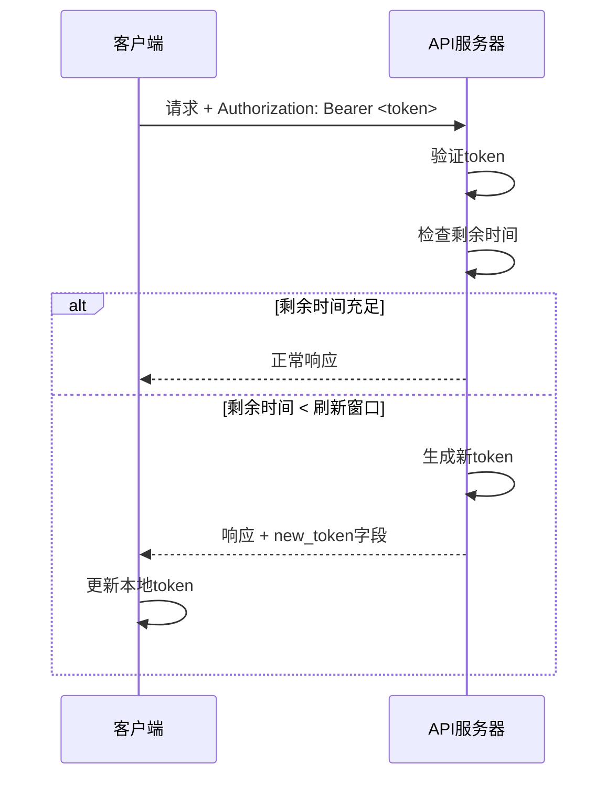

## Token自动刷新功能文档

## 概述

Token自动刷新功能实现了"滑动过期时间"（Sliding Expiration）机制，当用户使用有效token访问接口时，如果token即将过期，系统会自动生成新token并返回给客户端，无需用户重新登录。

## 工作原理

### 1. 刷新机制

```
Token生命周期:
├─ 创建时间 (iat)
├─ 刷新窗口开始 (50%时间点)
│  └─ 在此之后的请求会触发刷新
└─ 过期时间 (exp)
```

### 2. 刷新条件

```python
剩余时间 < 总有效期 × 刷新阈值
```

**默认配置**:
- 总有效期: 30000分钟（约21天）
- 刷新阈值: 0.5 (50%)
- 刷新窗口: 15000分钟（约10.5天）

**示例**:
- Token创建时间: 2026-01-18 08:00:00
- Token过期时间: 2026-02-08 08:00:00
- 刷新窗口开始: 2026-01-28 20:00:00
- 在2026-01-28 20:00:00之后的任何请求都会触发token刷新

### 3. 刷新流程



## 使用方法

### 方法1: 使用辅助函数（推荐）

```python
from flask import Blueprint, jsonify
from app.utils import verify_and_refresh_token, get_token_from_request, add_new_token_to_response

my_bp = Blueprint('my_api', __name__)

@my_bp.route('/my-endpoint', methods=['GET'])
def my_endpoint():
    # 获取token
    token, error_response = get_token_from_request()
    if error_response:
        return error_response
    
    # 验证并刷新token
    payload, new_token, error_message = verify_and_refresh_token(token)
    
    if payload is None:
        return jsonify({
            'success': False,
            'message': error_message or 'Token无效'
        }), 401
    
    # 业务逻辑
    user_id = payload.get('user_id')
    # ... 处理业务 ...
    
    # 构建响应
    response_data = {
        'success': True,
        'message': '操作成功',
        'data': {}
    }
    
    # 添加新token（如果有）
    response_data = add_new_token_to_response(response_data, new_token)
    
    return jsonify(response_data)
```

### 方法2: 使用装饰器

```python
from flask import Blueprint, jsonify, g
from app.utils import require_token_with_refresh

my_bp = Blueprint('my_api', __name__)

@my_bp.route('/my-endpoint', methods=['GET'])
@require_token_with_refresh
def my_endpoint():
    # 用户信息已存储在 g.current_user 中
    user_id = g.current_user.get('user_id')
    username = g.current_user.get('sub')
    
    # 业务逻辑
    # ...
    
    # 如果token被刷新，会自动添加到响应中
    return jsonify({
        'success': True,
        'message': '操作成功',
        'data': {}
    })
```

### 方法3: 使用中间件类

```python
from flask import Blueprint, jsonify
from app.middleware import create_token_middleware

my_bp = Blueprint('my_api', __name__)

# 在应用初始化时创建中间件
def init_app(app):
    global token_middleware
    token_middleware = create_token_middleware(app)

@my_bp.route('/my-endpoint', methods=['GET'])
def my_endpoint():
    from flask import request
    
    auth_header = request.headers.get('Authorization')
    if not auth_header:
        return jsonify({'success': False, 'message': '缺少token'}), 401
    
    token = auth_header.split()[1]
    payload, new_token = token_middleware.verify_and_refresh_token(token)
    
    if payload is None:
        return jsonify({'success': False, 'message': 'Token无效'}), 401
    
    # 业务逻辑
    response_data = {
        'success': True,
        'message': '操作成功',
        'data': {}
    }
    
    if new_token:
        response_data['new_token'] = new_token
    
    return jsonify(response_data)
```

## 客户端处理

### JavaScript/TypeScript

```javascript
// 封装API请求函数
async function apiRequest(url, options = {}) {
    // 从本地存储获取token
    let token = localStorage.getItem('token');
    
    // 添加Authorization头
    const headers = {
        'Content-Type': 'application/json',
        'Authorization': `Bearer ${token}`,
        ...options.headers
    };
    
    // 发送请求
    const response = await fetch(url, {
        ...options,
        headers
    });
    
    const data = await response.json();
    
    // 检查是否有新token
    if (data.new_token) {
        console.log('Token已自动刷新');
        localStorage.setItem('token', data.new_token);
    }
    
    // 处理401错误（token过期）
    if (response.status === 401) {
        console.log('Token已过期，请重新登录');
        localStorage.removeItem('token');
        window.location.href = '/login';
        return null;
    }
    
    return data;
}

// 使用示例
async function getUserProfile() {
    const data = await apiRequest('http://192.168.0.14:8000/api/user/profile');
    if (data && data.success) {
        console.log('用户信息:', data.data);
    }
}
```

### Python

```python
import requests

class APIClient:
    def __init__(self, base_url):
        self.base_url = base_url
        self.token = None
    
    def login(self, username, password):
        """登录获取token"""
        response = requests.post(
            f"{self.base_url}/api/login",
            json={"username": username, "password": password}
        )
        result = response.json()
        if result.get('success'):
            self.token = result.get('token')
            return True
        return False
    
    def request(self, method, endpoint, **kwargs):
        """发送请求，自动处理token刷新"""
        if not self.token:
            raise Exception("未登录")
        
        headers = kwargs.get('headers', {})
        headers['Authorization'] = f"Bearer {self.token}"
        kwargs['headers'] = headers
        
        response = requests.request(method, f"{self.base_url}{endpoint}", **kwargs)
        
        if response.status_code == 401:
            raise Exception("Token已过期，请重新登录")
        
        result = response.json()
        
        # 检查是否有新token
        if 'new_token' in result:
            print("Token已自动刷新")
            self.token = result['new_token']
        
        return result
    
    def get(self, endpoint, **kwargs):
        return self.request('GET', endpoint, **kwargs)
    
    def post(self, endpoint, **kwargs):
        return self.request('POST', endpoint, **kwargs)

# 使用示例
client = APIClient('http://192.168.0.14:8000')
client.login('admin', '123456')

# 获取数据，自动处理token刷新
result = client.get('/api/price-items?page=1&page_size=10')
print(result)
```

## 配置参数

### 环境变量配置

```bash
# .env文件
JWT_ACCESS_TOKEN_EXPIRE_MINUTES=30  # token总有效期（分钟）
```

### 代码配置

```python
from app.middleware import TokenRefreshMiddleware

middleware = TokenRefreshMiddleware(
    secret_key='your-secret-key',
    algorithm='HS256',
    expire_minutes=30,        # token总有效期
    refresh_threshold=0.5     # 刷新阈值（0-1之间）
)
```

**refresh_threshold参数说明**:
- `0.5`: 当剩余时间 < 50%时刷新（推荐）
- `0.3`: 当剩余时间 < 30%时刷新（更保守）
- `0.7`: 当剩余时间 < 70%时刷新（更激进）

## 响应格式

### 正常响应（无需刷新）

```json
{
  "success": true,
  "message": "操作成功",
  "data": {}
}
```

### 刷新响应（包含新token）

```json
{
  "success": true,
  "message": "操作成功（token已刷新）",
  "data": {},
  "new_token": "eyJhbGciOiJIUzI1NiIsInR5cCI6IkpXVCJ9..."
}
```

### 错误响应（token无效）

```json
{
  "success": false,
  "message": "Token无效或已过期"
}
```

## 测试

### 运行测试脚本

```bash
python test_token_refresh.py
```

### 手动测试

```bash
# 1. 登录获取token
curl -X POST http://192.168.0.14:8000/api/login \
  -H "Content-Type: application/json" \
  -d '{"username":"admin","password":"123456"}'

# 2. 使用token访问接口
curl -X GET "http://192.168.0.14:8000/api/price-items?page=1&page_size=5" \
  -H "Authorization: Bearer <your_token>"

# 3. 检查响应中是否有new_token字段
```

## 优点

1. **用户体验好**: 用户无需频繁登录，会话自动延长
2. **安全性高**: token仍然有过期时间，不活跃用户会自动登出
3. **实现简单**: 无需单独的刷新接口
4. **向后兼容**: 客户端可以选择是否使用新token

## 注意事项

1. **客户端必须处理new_token**: 如果客户端不更新token，旧token过期后会无法访问
2. **并发请求**: 多个并发请求可能都返回新token，客户端应该使用最新的
3. **性能影响**: 每次请求都会检查token，但性能影响很小
4. **日志记录**: token刷新会记录日志，便于监控

## 与传统刷新token的对比

| 特性 | 自动刷新 | 传统刷新token |
|------|----------|---------------|
| 用户体验 | ✓ 无感知 | 需要处理刷新逻辑 |
| 实现复杂度 | ✓ 简单 | 需要额外接口 |
| 安全性 | ✓ 高 | 高 |
| 服务器负载 | 略高（每次检查） | 低（按需刷新） |
| 客户端复杂度 | ✓ 低 | 高（需要刷新逻辑） |

## 总结

Token自动刷新功能提供了一种简单而有效的方式来延长用户会话，提高用户体验的同时保持系统安全性。建议在所有需要认证的接口中使用此功能。
